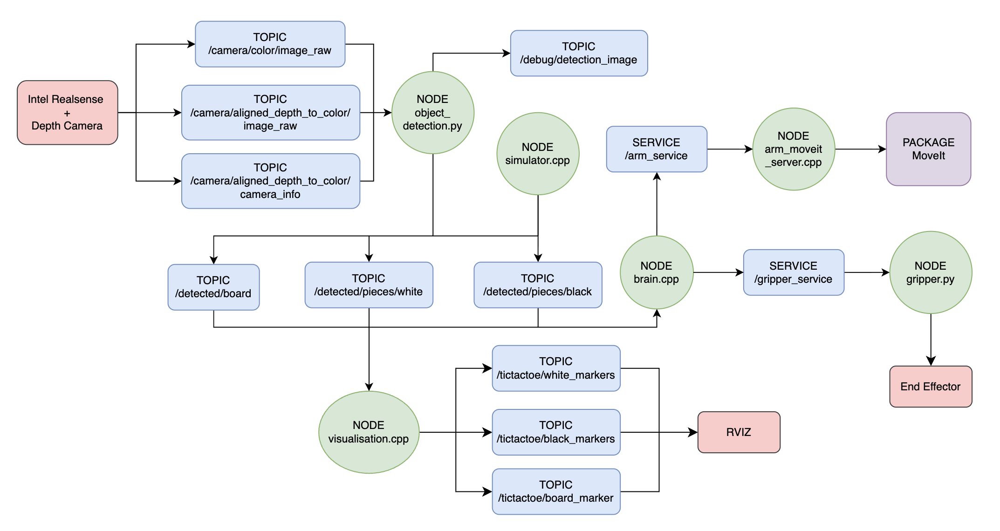
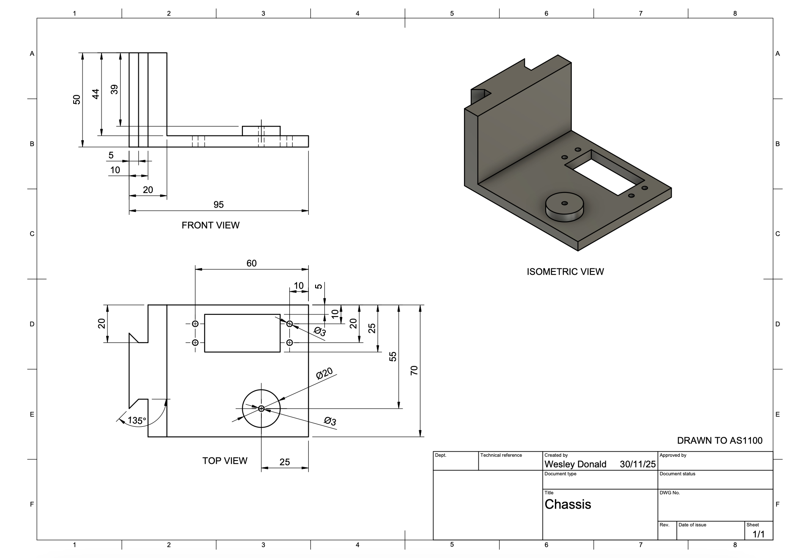
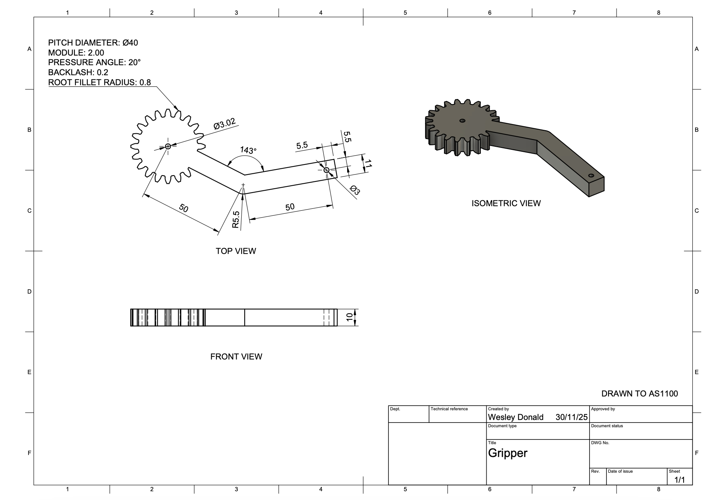
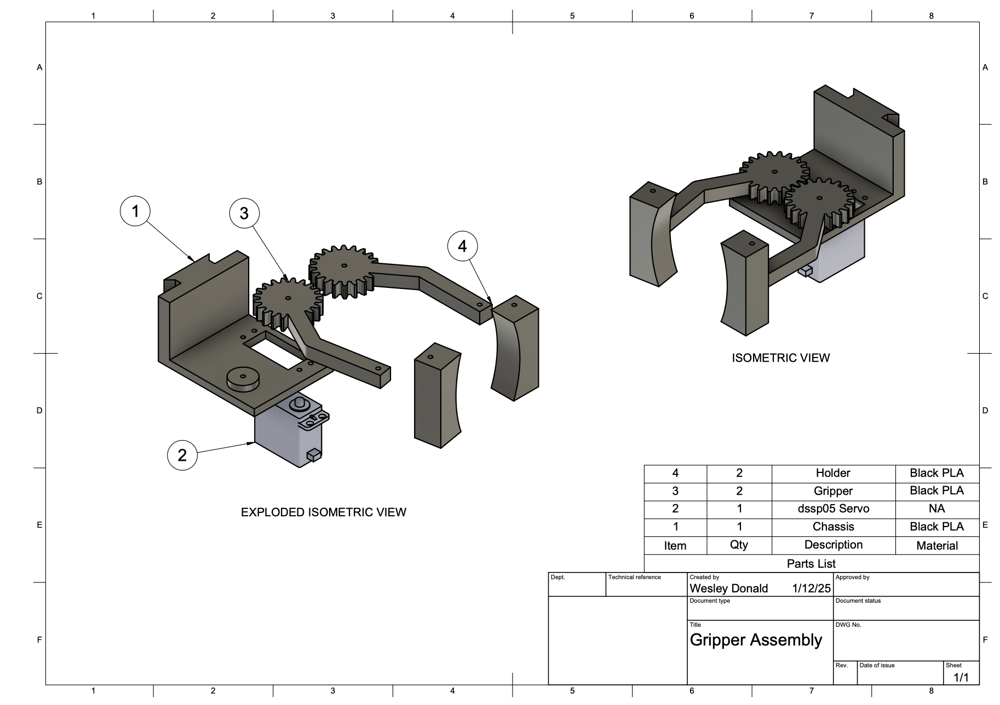
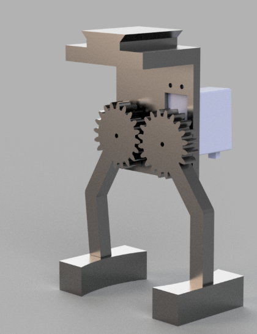
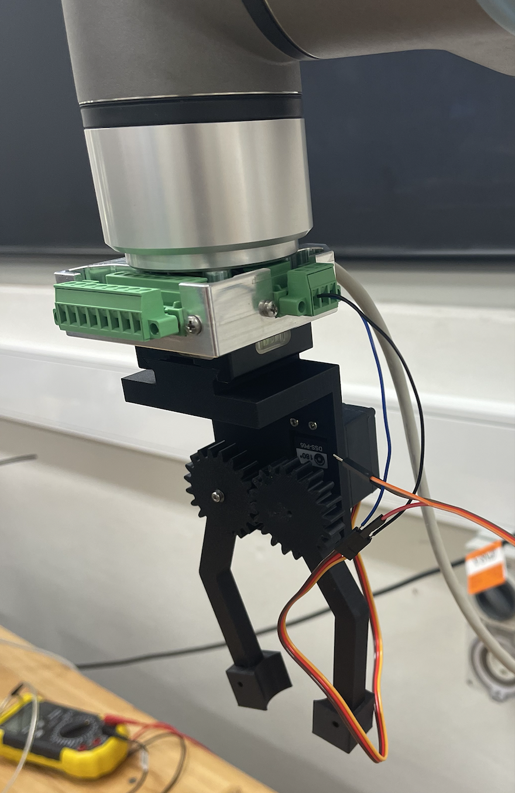
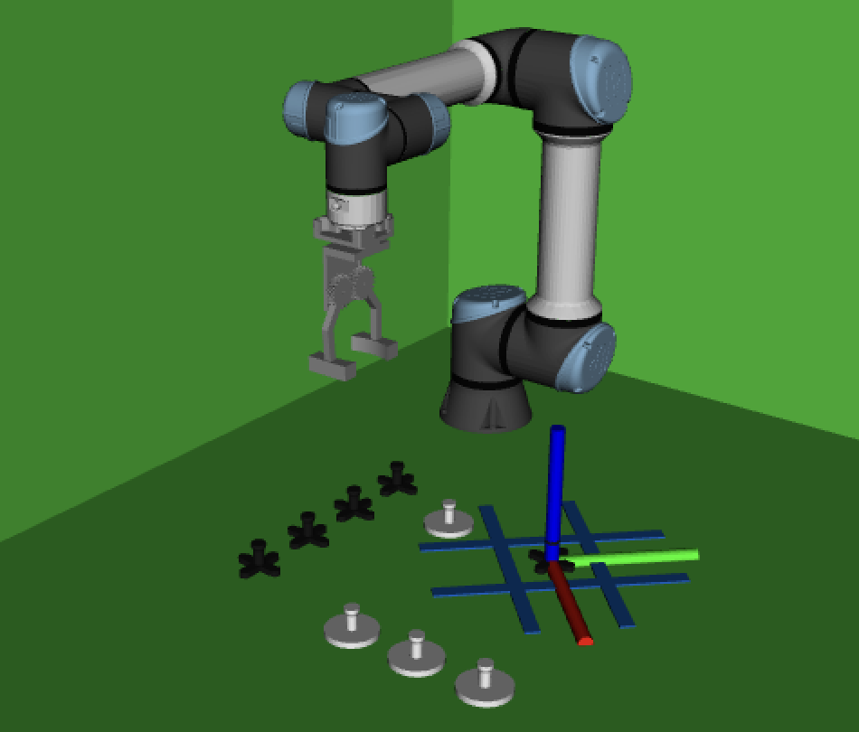
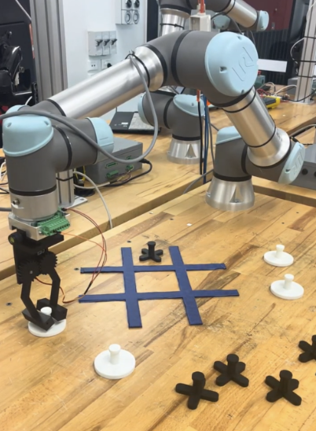
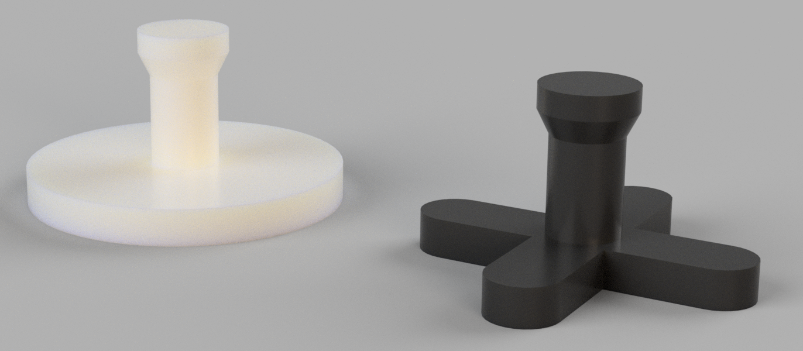

<!-- omit from toc -->
# MTRN4231 - Capstone Mechatronics Project 

[README Checklist](https://docs.google.com/document/d/1zuUf0pBpQOLhTJfOn6BVm4h70meYy5rnrdafGd6j8Xo/edit?tab=t.0)


# Table of Contents
1. [Project Overview](#project-overview)
2. [System Architecture](#system-architecture)
   - [ROS2 Architecture](#ros2-architecture)
   - [State Machine](#state-machine)
4. [Technical Components](#technical-components)
   - [Computer Vision](#computer-vision)
   - [Custom End-Effector](#custom-end-effector)
   - [System Visualisation](#system-visualisation)
   - [Closed-Loop Operation](#closed-loop-operation)
5. [Installation and Setup](#installation-and-setup)
6. [Running the System](#running-the-system)
7. [Results and Demonstration](#results-and-demonstration)
   - [Innovation](#innovation)
   - [Robustness](#robustness)
   - [Adaptability](#adaptability)
8. [Discussion and Future Work](#discussion-and-future-work)
   - [Major Enginnering Challenges](#major-engineering-challenges)
   - [Future Enhancements](#future-enhancements)
   - [Novel Approaches](#novel-approaches)
9. [Contributors and Roles](#contributors-and-roles)
10. [Repository Structure](#repository-structure)
11. [References and Acknowledgements](#references-and-acknowledgements)

<div align="justify">
   
---

# Project Overview 
This system addresses the problem of poor engagement in current stroke rehabilitation. Traditional therapy methods are often highly repetitive, isolating, and provide no data tracking for the patient. Our intended customer is a post-stroke patient with hand weakness, personified as *Nick*, a 68 year old former engineer who loves robotics and strategy games. Our solution combines a UR5e robotic arm with a physical game of Tic-Tac-Toe, turning therapy into an activity that feels like play. The entire process is managed by a ROS2-based architecture.

The robot's behavior follows this sequence:

1. **Start-up**: The game is initiated via terminal, and the player moves first.
2. **Perception**: A depth camera views the scene and detects the locations of the game board and all pieces.
3. **Decision**: Once the player's move is detected, the brain node processes the board state and decides on the best move to make.
4. **Action**: The brain sends commands to the arm and gripper. The robot uses a custom-designed gripper mounted to the UR5e arm.
5. **Execution**: The arm moves to the decided piece, grips it, and places it in the desired location on the board.
6. **Loop**: The arm then returns to a home position and waits for the player to take their turn.

The full behaviour can be seen in the [functionality demo](https://drive.google.com/file/d/1CPIxWg0ur2wqS3amkw4ajLEvb_dR5X6y/view?usp=drive_link) and the system visualisation can be observed in the [visualisation demo](https://drive.google.com/file/d/1lPf4V6NlLgwOl6tRVGjNmHHzRr6m4RVj/view?usp=drive_link).

---

# System Architecture

## ROS2 Architecture

Below is a diagram of ROS2 packages, nodes, topics, and services used in this project.

<p align="center">
  
</p>

The key nodes are:
 * `arm_moveit_server.cpp`: A server to the `brain` node and uses cartesian based path planning to move to a required `target_pose`.
 * `brain.cpp`: A client to the `arm` and `gripper` nodes and behaves as outlined in the [state machine section](#state-machine).
 * `object_detection.py`: Detects the board and pieces as outlined in the [computer vision section](#computer-vision).
 * `gripper.py`: A server to the `brain` node as described in the [custom end-effector section](#custom-end-effector).
 * `simulator.cpp`: Used to mimick the behaviour of the `object_detection` when testing in the simulation.
 * `visualisation.cpp`: Implements the behaviour outlined in the [system visualisation section](#system-visualisation).

The following table includes a list of all the publisher/subscriber relationships, along with their message types.

<div align="center">

| Topic Name                                      | Publisher          | Subscriber              | Type              |
|-------------------------------------------------|---------------------|--------------------------|-------------------|
| `/detected/board`                                 | object_detection | brain, visualisation, simulator | `BoardPose.msg`     |
| `/detected/pieces/white`                          | object_detection | brain, visualisation, simulator | `PoseArray`         |
| `/detected/pieces/black`                          | object_detection | brain, visualisation, simulator | `PoseArray`         |
| `/tictactoe/white_markers`                        | visualisation   | RViz                        | `MarkerArray`       |
| `/tictactoe/black_markers`                        | visualisation   | RViz                       | `MarkerArray`       |
| `/tictactoe/board_marker`                         | visualisation   | RViz                       | `Marker`            |
| `/debug/detection_image`                          | object_detection | —                        | `Image`             |
| `/camera/color/image_raw`                         | —                   | object_detection      | `Image`             |
| `/camera/aligned_depth_to_color/image_raw`        | —                   | object_detection      | `Image`             |
| `/camera/aligned_depth_to_color/camera_info`      | —                 | object_detection      | `Image`             |

</div>

Note the only custom message is `BoardPose.msg` which is defined as follows:

```cpp
// BoardPose.msg
geometry_msgs/PointStamped point
float64 anglerad
```

The following table includes a list of all the client/server relationships, along with their message types.

<div align="center">

| Service Name    | Client | Server            | Type              | Description                                      |
|-----------------|--------|-------------------|-------------------|--------------------------------------------------|
| arm_service     | brain  | arm_moveit_server | `MoveArm.srv`       | Sends: `geometry_msgs/Pose target_pose` and `bool move_home` <br> Recieves: `string response` and `bool success` |
| gripper_service | brain  | gripper           | `CloseGripper.srv`  | Sends: `string command` <br> Recieves: `string response` and `bool success` |

</div>

 ## State Machine

The system is controlled by a two-tier state machine. At the top level, the game progresses through three high-level states, `PLAYER_TURN`, `ROBOT_TURN` and `FINISHED`. These high-level states describe the game flow, while a secondary set of action states manages the robot’s physical motion.
  
<p align="center">
  
</p>

During `ROBOT_TURN`, the system enters a sequence of low-level action states that move the robot through the pick-and-place routine. Each action triggers a ROS 2 service call to either the arm or gripper node. Once the service responds successfully, the state machine transitions to the next action until the full sequence completes. When all actions succeed, the system returns the arm to its home position and switches back to `IDLE`.

<p align="center">
  
</p>

If any arm or gripper service reports a failure, the current action sequence is immediately aborted. The system attempts to move the robot to its home position to prevent undefined behaviour. The high-level state machine transitions to `FINISHED` and `IDLE`.

---

# Technical Components

## Computer Vision
The computer vision uses an Intel RealSense camera to detect the board and classify the white and black playing pieces. The RGB image is processed using colour thresholding while the aligned depth camera is used to convert pixel coordinates into 3D positions in the robot’s `base_link` frame.

A trapezoidal region-of-interest (ROI) restricts detection to the table workspace. The board is identified by HSV colour thresholding, Canny edge extraction and Hough line detection, which gives both the board’s centre and orientation. The orientation is found using a *line of best fit* approach. A rolling average filter stabilises the board pose before broadcasting a TF frame for the board and its 3×3 grid (`board_index[i]`).

White and black pieces are detected separately using tuned HSV thresholds, filtering, and contour solidity/area checks to reject noise. For each valid contour, image moments provide the pixel centroid. Each piece is published as a `PoseArray` in `base_link`, and TF frames are broadcast as well.

Finally, a filtering stage selects the most stable detection set across multiple frames, improving robustness to flickering elements. This pipeline provides reliable board localisation and piece detection for planning in the `brain` package. A debugging image is published to `debug/detection_image` as follows,

<p align="center">
  
</p>

## Custom End-Effector
The follow engineering drawings are to AS1100 and include all the dimensions required to reproduce the end effector.

<p align="center">
  
</p>

<p align="center">
  
</p>

<p align="center">
  
</p>

<p align="center">
  
</p>

All manufactured parts can be printed with PLA. The DSS-P05 servo is secured to the chassis using four 2.5 mm bolts. One gripper arm is bonded to a standard servo horn using two-part epoxy. The second gripper arm is mounted directly to the chassis using a 2.5 mm bolt. The interchangeable holders can be attached to the gripper simply via a friction fit. A full render and image of the assembled end effector is shown below.

<p align="center">
  
  
</p>

The end effector is actuated using a DSS-P05 servo, controlled through a ROS 2 node (`gripper`) that communicates with an Arduino over a serial connection. The node exposes a custom service (`/gripper_service`) which accepts either `"open"` or `"close"` as valid commands.

When the node starts, it attempts to open the serial port (`/dev/ttyUSB0`). If successful, commands recieved through the service are forwarded directly to the Arduino, which actuates the servo accordingly. If the Arduino is not connected, the node logs a warning but remains active so that the rest of the system can continue operating.

Mechanically, the chassis mounts to the UR5 wrist using a Housing Block and an End Effector Mount. The end effector’s mass is included in the URDF to ensure accurate planning and simulation. The URDF also defines collision geometry and a mesh to visualise the end effector in rviz.

## System Visualisation
The system is visualised in RViz, where both the UR5e robot and the custom gripper URDF are loaded through a combined launch sequence that starts the UR driver, MoveIt, and RViz with a custom configuration. RViz displays the full robot model alongside several marker topics published by the visualisation node, which provides a live representation of the detected board as well as the black and white game pieces. These markers are generated from perception inputs (`/detected/board`, `/detected/pieces/white`, /`detected/pieces/black`) and rendered as mesh resources, allowing the operator to observe the system’s understanding of the game state. This visualisation demonstrates the TF alignment of the board as well.

<p align="center">
  
</p>

## Closed-Loop Operation
The Brain node continuously monitors the most recent positions of all pieces on and off the board. When the game starts, the locations of all elements can be anywhere in the robots reachable workspace for correct operation. The only assumption that has been made is the board will not move during the game, which would result in undefined behaviour. When the player makes a move, the Brain node uses the latest piece locations to determine which piece to pick up, ensuring correct selection even if pieces have shifted during the game.

---

# Installation and Setup
Step-by-step installation instructions, dependencies, workspace setup.  
Hardware setup details (UR5e, camera, Teensy, etc.).  
Environment variables, config files, calibration procedures.

---

# Running the System
Instructions for launching and running the complete system.  
Example commands.  
Expected behaviour and example outputs.  
Optional troubleshooting notes.  
System must launch via a single command.

---

# Results and Demonstration

The system is designed to perform against a set of quantitative metrics that ensure it is responsive, accurate, and safe for the end-user. These are the design targets the system is engineered to meet:

<div align="center">

| Category      | Metric                    | Target Goal            | Reality        |
|---------------|---------------------------|------------------------|----------------|
| Response Time | Board State Detection     | < 5 seconds            | ~3 seconds     |
| Response Time | ROBOT_TURN Time           | < 12 seconds           | ~10 seconds    |
| Repeatability | Optimal Game Strategy     | 100%                   | 100%           |
| Repeatability | Piece Pickup Success      | ≥ 90%                  | ~95%           |
| Accuracy      | Piece Pickup/Placement    | ± 20 mm                | ± 20 mm        |

</div>

The above metrics were determined by running the game 10 times in different scenarios and keeping track of the results.

<p align="center">
  
</p>

## Innovation: 

The main innovation of this system is leveraging computer vision to detect the board's angle. This allows the robot to accurately identify the grid and play correctly regardless of how the board is rotated, offering significant flexibility and robustness over systems that require a fixed, pre-calibrated orientation. No aruco markers or changing the perspective of the camera is required, meaning our computer vision pipeline is more robust than systems which use fixed location items.

## Robustness:

The `brain` node manages game logic and decisions, decoupling tasks and making the system easier to debug and maintain. The custom designed gripper has replaceable holders which allows for about ± 20 mm of error from the computer vision pipline, used for reliable grasping. The game pieces are also custom designed with a small tab which ensures a consistent grip. The pieces have a diameter of 60 mm which allows for ± 20 mm of error as the board squares are 100 mm $^2$.

<p align="center">
  
</p>

## Adaptability:
The system uses a depth camera for perception, allowing it to detect the board and piece locations dynamically. This makes it adaptable to changes in pieces positions, rather than relying on fixed, hard-coded coordinates. The modular package design means components can be individually upgraded or even swapped. For example, the `brain` node's Tic-Tac-Toe logic could be replaced with logic for a different game (like checkers or chess) without redesigning the entire arm or gripper packages.

---

# Discussion and Future Work

## Major Engineering Challenges

One of the main challenges was working with an unfamiliar package, MoveIt. Identifying a reliable workflow required significantly more time than expected and involved lots of documentation reviews, peer discussion, and experimentation. In the end we were unable to use orientation constraints and found that joint constraints significantly decreased the planning time, additionally cartesian planning was found to be far superior to MoveIts' default planner.

Another challenge was allocating tasks in a way that matched team strengths while keeping progress aligned. For example, Wesley worked on the brain logic, but meaningful testing was difficult until the computer vision pipeline existed. This was addressed by developing a simulation package that replicates the CV node and produces hard coded board and piece locations.

Maintaining an up to date system architecture was also essential to ensure consistent topic and service definitions across all components. Hardware design presented an additional major challenge, as it was a weaker area for the group. Several prototype iterations were required: the first design was not 3D printable, the second could not be assembled, and only after redesigning did we arrive at a simple, modular final end effector.

## Future Enhancements

There were several stretch goals the team would have liked to implement with more time, including:

* **Dynamic Obstacle Avoidance**: Program the camera to detect additional obstacles, such as a player's hand, entering the workspace. When an unexpected object is present, prevent any arm movement which could injure the player.
* **Mid-Game Board Tracking**: Implement continuous board detection to compensate if the board is accidentally bumped or moved during gameplay. This would require updating the transformation frames of each board location.
* **Angled Surface Compensation**: Extend the vision pipeline to play on surfaces that are tilted or uneven. Currently it is assumed the board will always be on a flat surface at $z=0$.
* **Illegal Move Detection**: Add logic to identify when a player moves an on board piece off the board and automatically fix the illegal move.
* **YOLO Based Detection**: A weakness of the current implementation is the computer vision can vary in accuracy depending on the location. Using YOLO would improve the robustness of the system in different lightings (with a well trained model).

## Novel Approaches

The system's core novelty lies in its robustness to board placement. Using CV techniques, the robot dynamically finds the game board and calculates its precise angle of rotation in real-time. This eliminates the need for a fixed, perfectly aligned camera or board, allowing a user to simply place the board at any angle and start playing.

The robot isn't just a physical mover; it's a perfect player. It leverages the Minimax algorithm to find the best move. This ensures the robot always plays an optimal move, either winning or forcing a draw.

Modular & Decoupled Architecture: The system is built with a clear separation of concerns. The Computer Vision, the Game Logic, and the Robot Control are all independent modules. This makes the system significantly easier to debug, test, and upgrade. 

Precise 2D-to-3D Coordinate Mapping: A key challenge is translating what the 2D camera "sees" into real-world 3D coordinates for the robot arm. This project implements a robust camera-to-robot calibration routine. This ensures that when the vision system identifies the center of a square at pixel $(x, y)$, the robot arm moves to the exact corresponding $(X, Y, Z)$ physical location to place the piece.

# Contributors and Roles
All group members were involved in all aspects of the project, however the main roles ended up as follows;

Ryan - Computer Vision, End effector design, Moveit constraints.

Sherry - End effector package, UDRF + Launch files.

Wesley - Gameplay Logic, End effector CAD, Moveit path planning.

---

# Repository Structure
The repository structure is as follows:

```
images/
src/
   arm/
   brain/
   cv/
   end_effector/
   interfaces/
   simulation/
   visualisation/
   webui/
```

The `src/` folder includes the core ROS 2 packages: `arm/` handles motion planning and robot control, `brain/` manages the game logic and state machine, `cv/` performs board detection, `end_effector/` controls the gripper, `interfaces/` defines custom message and service types, `simulation/` simulates computer vision, `visualisation/` publishes markers to rviz, and `webui/` hosts the user interface. The `images/` directory contains all images used in the report.

---

# References and Acknowledgements
This project uses several external tools and libraries, including OpenCV for computer vision, pyserial for Arduino communication, RViz2 for visualisation, and Gazebo for simulation. We also acknowledge the UR driver and MoveIt frameworks that support the robot control pipeline. We would like to thank the demonstrators David, Alex, and Saba for their consistent guidance and support throughout the project.

</div>
